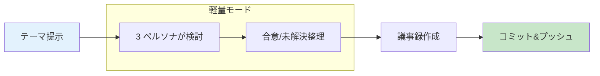

# 学生向け crlBrain 導入マニュアル

> [!abstract]
> crlBrain は **研究室の知的資産を世代を超えて伝える仕組み** です。本マニュアルは「研究の壁打ち」を中心に、AI CLI（Claude Code / Gemini CLI / Copilot CLI / Codex CLI）を使って crlBrain を始めるための導入ガイドです。
> 前提知識（git 操作・SSH 鍵・Node.js など）は [学生向け前提ガイド](./student-prereq.md) を先に参照してください。

---

## 1. はじめに — crlBrain とは

crlBrain は、五十嵐研究室の研究議論を **専門家ペルソナ群との壁打ち** に基づいて構造化し、議事録と知識ライブラリに蓄積する研究支援プラットフォームです [D]。

従来、研究室の学生が試行錯誤して得た「どう考えたか」「どこでつまずいたか」の知見は、卒業とともに失われていました。crlBrain はこのパターンを蒸留・再利用可能にして、次世代の学生の思考を加速することを目的とします [D]。

### なぜ「壁打ち」が資産になるか

- [D] 研究テーマの良し悪しは、最終的な成果物よりも **「どう議論したか」** に強く依存する
- [C] 専門家ペルソナ群との壁打ちは、先輩や指導教員が不在の時間帯でも「思考の足場」として機能する
- [A] 主張を [A]/[B]/[C]/[D] の 4 階層に分類する規律は、推測と事実の混同を防ぐ（憲法 claude 第 9 条）

### 本マニュアルのスコープ

本マニュアルでは、**最初の 30 分で壁打ちを体験** することを目標にします。[C]

- ✅ 軽量 3 ペルソナ（Prof.Igarashi + Dr.FEP + Dr.AI）での壁打ち
- ✅ 4 階層分類の付け方
- ✅ セッションブランチ運用 + 議事録 + コミット
- ⏭ フル版 5 Phase（Framing → Rounds → Integration → Dispatch → Recording）は § 6 で誘導

---

## 2. 壁打ちの全体像



| ステップ | 所要時間（目安）| 内容 |
|---------|-------------|------|
| テーマ提示 | 3-5 分 | 「何を解決したいか」を自分の言葉で述べる |
| 3 ペルソナ検討 | 10-15 分 | Prof.Igarashi / Dr.FEP / Dr.AI が順に意見を述べる |
| 合意/未解決整理 | 5 分 | 合意事項・未解決論点・次アクションを箇条書きにする |
| 議事録作成 | 5 分 | `sessions/discussions/` にメモを保存 |
| コミット&プッシュ | 2 分 | `[topic-id]` prefix 付きでコミット |

所要時間は軽量モード想定 [C]。フル版は 1-2 時間以上かかる。

---

## 3. CLI の選択ガイド

本マニュアルは 4 種類の AI CLI に対応しています。まず自分に合う CLI を選んでください。

### 3.1 決定木（まずはこれで選ぶ）

```
Q1. Claude のサブスクリプション（Pro / Max）を持っているか？
    ├─ YES → Claude Code を選ぶ（推奨・完全版）
    └─ NO  → Q2 へ

Q2. ChatGPT Plus 以上に加入済か？
    ├─ YES → Codex CLI を選ぶ
    └─ NO  → Q3 へ

Q3. GitHub Student Developer Pack が有効か？
    ├─ YES → Copilot CLI を選ぶ（登録停止中のため既存 Pack 保持者のみ。§ 3.2 参照）
    └─ NO  → Gemini CLI を選ぶ（完全無料）
```

### 3.2 比較表

| 項目 | Claude Code | Gemini CLI | Copilot CLI | Codex CLI |
|------|-------------|-----------|-------------|-----------|
| 料金 | Pro $20/月〜 | 無料 | Student Pack で無料 | ChatGPT Plus $20/月 |
| Hook 自動化 | ✅ | ❌ | ❌ | ❌ |
| skills 対応 | ✅ | ✅ | ✅ | △ slash 別機構 |
| Memory 自動更新 | ✅ | ❌ | ❌ | ❌ |
| 推奨ペルソナ数 | 25 | 3 | 3 | 3 |
| 新規登録可否（2026-04 現在）| ✅ | ✅ | ❌ 停止中 [A] | ✅（Plus 必須）|
| 詳細ガイド | [CC 版](./student-mode-claude-code.md) | [Gemini 版](./student-mode-gemini.md) | [Copilot 版](./student-mode-copilot-cli.md) | [Codex 版](./student-mode-codex.md) |

### 3.3 迷ったら

最もシンプルな選び方は **Gemini CLI（完全無料・新規可）** です [C]。先輩や指導教員が CC を使っている場合は、途中から Claude Code に乗り換えるのも容易です。

---

## 4. 最初の 30 分 — はじめての壁打ち

本節は全 CLI 共通の手順です。CLI 固有のセットアップは § 3 の詳細ガイドを参照してください。

### 4.1 ブランチを切る

**`main` ブランチでの作業は禁止** です（CLAUDE.md 規約）。セッションの最初に必ず `session/` ブランチを作ってください。

```bash
# 現在のブランチを確認
git branch --show-current

# main にいる場合、session ブランチを作成
git checkout -b session/20260421-brain-my-first-session
```

ブランチ命名規則: `session/YYYYMMDD-{topic-id}-{slug}`

- `YYYYMMDD` は JST の日付
- `{topic-id}` は `topics.yaml` の既存 ID（PHS / SGA / FEP / RSM / TAHARA / crlBrain 等）、または仮の `brain`
- `{slug}` は英小文字 + ハイフンで内容を簡潔に（例: `first-session`）

### 4.2 3 ペルソナで壁打ち開始の呪文

CLI を起動したあと、以下の呪文をコピペしてセッションを開始:

```
以下のペルソナファイルを読み込んでセッションを開始してください:
- agents/pi-igarashi/SOUL.md, SKILL.md
- agents/fep-neuroscientist/SOUL.md, SKILL.md
- agents/ai-researcher/SOUL.md, SKILL.md

room-config.md を読み込み、Manager として挨拶してください。
軽量セット（3 ペルソナ）で壁打ちを行います。
4 階層分類 [A]/[B]/[C]/[D] を全発言で明示してください。

私のテーマ: <ここにテーマを 1-2 文で書く>
```

この呪文が長くて毎回書くのが面倒な場合は、CLI ごとの設定ファイル（`CLAUDE.md` / `GEMINI.md` / `AGENTS.md`）に仕込んでおけます。詳細は CLI 別ガイド参照。

### 4.3 4 階層分類 [A]/[B]/[C]/[D] のつけ方

全ての発言・議事録・コミットメッセージの主張に階層タグを付けます。

| 階層 | 名称 | 使うとき | 例 |
|------|------|---------|-----|
| **[A]** | 学術的事実 | 論文・教科書・公式 Docs・数式を一次ソースに引用可 | [A] LSTM は 1997 年に Hochreiter & Schmidhuber が提案した |
| **[B]** | 実験結果確認事項 | 事前登録 PASS 基準達成 or 統計検定で帰無仮説棄却 | [B] n=30 で p < 0.01、Primary PASS |
| **[C]** | 尤もらしい見解 | 実験観察の外挿・内挿。統計的根拠なし | [C] n=20 でも effect size は維持されると予測 |
| **[D]** | 直感的仮説 | 理論推論・類推・経験則。データ未支持 | [D] σ_train が seed 依存性の原因と直感される |

> [!warning]
> [C] や [D] を [B] として扱うのは **narrative drift（物語の漂流）** と呼ばれる重大違反です。憲法 claude 第 9 条で厳格に禁止されています。

> [!note] 禁止語 "literal"
> `literal` という語は複数階層を混同しがちな **crutch word** として禁止されています。代わりに [A]/[B]/[C]/[D] で主張を明示してください。

### 4.4 議事録を残す（簡易テンプレート）

`sessions/discussions/{topic-id}/` に以下のテンプレートで保存します。ファイル名は `YYYYMMDD_HHMM_<slug>.md`。

```markdown
---
title: "[topic-id] セッションタイトル"
date: 2026-04-21
branch: session/20260421-brain-my-first-session
participants:
  - Prof.Igarashi
  - Dr.FEP
  - Dr.AI
  - <あなたの名前>
topic_id: crlBrain
---

# セッション議事録

## 概要（1〜3 文）

<!-- 今日何を議論し、何が決まったか -->

## 主張の 4 階層分類まとめ（必須）

### [A] 学術的事実
-

### [B] 実験結果（統計的根拠あり）
-

### [C] 尤もらしい見解
-

### [D] 直感的仮説
-

## 合意事項
-

## 未解決論点
- [ ]

## 次のアクション
- [ ] 担当者: アクション内容（期限）
```

議事録生成を自動化したい場合、CC なら `/discussion-memo-output` スキル、他 CLI なら同等スキルが存在する場合あり（各 CLI ガイド参照）。

### 4.5 コミット&プッシュ

**全コミットに `[topic-id]` prefix が必要** です（CLAUDE.md 規約）。

```bash
git add sessions/discussions/crlBrain/20260421_1530_first-session.md
git commit -m "[crlBrain] 初回壁打ちセッション議事録"
git push -u origin session/20260421-brain-my-first-session
```

- 話題が複数トピックにまたがる場合は、一番関係が深い topic-id を選ぶ
- どのトピックにも該当しない場合は `[crlBrain]` を使う
- `[topic-id]` prefix は CLAUDE.md 規約（session/* ブランチでは hook 自動 reject なし、規約上の義務）[A]
- 禁止語 `literal` を含むコミットメッセージは commit-msg hook で自動 reject される（全ブランチ対象）[A]

---

## 5. 困ったときの FAQ

### Q: AI が議論を進めすぎて置いてけぼりになった

**A:** 「ストップ」「少し戻って」「分からなかったので説明して」と日本語で介入してください。AI は常にユーザー（=PI）が最終決定権を持つ設計です。[A]（room-config.md § 3 の User-Driven Co-Creation 原則）

### Q: どのペルソナを呼ぶか迷う

**A:** 最初は本マニュアルの 3 固定（Prof.Igarashi / Dr.FEP / Dr.AI）で十分です [C]。数セッション経験したら以下を参考に追加:

- 数理の厳密性が必要 → **Dr.Math**
- 認知プロセスを深掘り → **Dr.Cognition**
- 実装詳細 → **Dr.Architect** / **Dr.Control**
- 新規性評価 → **Dr.Reviewer**

全 25 ペルソナは `agents/README.md` を参照。

### Q: 壁打ちしてみたいテーマがない

**A:** 研究室の既存トピックを壁打ち相手にどうぞ [D]:

- **PHS** — 群知能 × 自由エネルギー原理
- **SGA** — サプライズ誘導メタ認知アシスト
- **RSM** — Active Inference によるストレス・フロー識別
- **FEP** — 自由エネルギー原理ライブラリ
- **TAHARA** — FEP に基づく運動熟達支援

「`topics.yaml` の PHS を読んで、自分がこのテーマを引き継ぐとしたら何が気になるか壁打ちして」と呪文に付け足せば着火できます。

### Q: フル版とは何か、今すぐ切り替えるべきか

**A:** フル版は 25 ペルソナ + 5 Phase 構成で、品質スコアカードや Agent Dispatch を使って研究提案書レベルの成果物を作るモードです。詳細は § 6 を参照。**軽量モードで 3-5 セッション経験してからフル版へ** がおすすめ [C]。

### Q: CLI が途中で止まる・エラーが出る

**A:** CLI 固有の原因であることが多いので、該当 CLI のガイドの FAQ 節を参照:

- Claude Code: [student-mode-claude-code.md](./student-mode-claude-code.md)
- Gemini CLI: [student-mode-gemini.md](./student-mode-gemini.md)
- Copilot CLI: [student-mode-copilot-cli.md](./student-mode-copilot-cli.md)
- Codex CLI: [student-mode-codex.md](./student-mode-codex.md)

### Q: 途中で別のブランチに移動したくなった

**A:** 変更をコミットするかスタッシュ（`git stash`）してから移動してください。`main` に戻るのは OK ですが、**`main` でコミットしない** こと。

---

## 6. 慣れたらフル版へ

軽量モード（本マニュアル）では以下を省略しています:

| 機能 | 軽量モード | フル版 |
|------|---------|-------|
| ペルソナ数 | 3 固定 | 最大 25（Tiered Loading で動的ロード）|
| Phase 構成 | Framing + 1-2 ラウンドのみ | 5 Phase（Framing → Rounds → Integration → Dispatch → Recording）|
| 品質スコアカード | なし | Novelty / Rigor / Significance 各 1-5 点 |
| Agent Dispatch | なし | `/related-work-survey` `/theoretical-proof` `/impact-analysis` 等 |
| Library 蒸留 | なし | Dr.Veritas 検証 + `knowledge/library/` 登録 |

フル版への移行は `room-config.md` の **§ 5 Loading Protocol**（Tiered Loading）から始めるのが自然です [D]。最初に軽量 3 人に追加するなら **Dr.Math**（数理の厳密性）を推奨します [C]。

詳細なフェーズ仕様は [docs/manual-detailed.md](./manual-detailed.md)、短いクイックスタートは [docs/manual-quickstart.md](./manual-quickstart.md) を参照してください。

---

## 7. 前提・用語集

- 前提知識（git / SSH / Node.js 等）: [学生向け前提ガイド](./student-prereq.md)
- 用語集（動的更新）: `knowledge/dictionary/`
- 議論プロトコル全文: [room-config.md](../room-config.md)
- 4 階層分類の詳細事例: [docs/constitution/constitution_claude.md](./constitution/constitution_claude.md) 第 9 条

---

## 参照ドキュメント

| ドキュメント | 内容 |
|------------|------|
| `docs/student-prereq.md` | 前提知識ガイド |
| `docs/student-mode-claude-code.md` | Claude Code 版 CLI ガイド |
| `docs/student-mode-gemini.md` | Gemini CLI 版 CLI ガイド |
| `docs/student-mode-copilot-cli.md` | Copilot CLI 版 CLI ガイド |
| `docs/student-mode-codex.md` | Codex CLI 版 CLI ガイド |
| `room-config.md` | 議論プロトコル・Tiered Loading |
| `docs/manual-quickstart.md` | フル版クイックスタート |
| `docs/manual-detailed.md` | フル版詳細仕様 |

## 更新履歴

| 日付 | 変更者 | 変更内容 |
|------|------|---------|
| 2026-04-21 | Claude (session/20260421-crlbrain-student-onboarding-manual) | 初版作成 |
